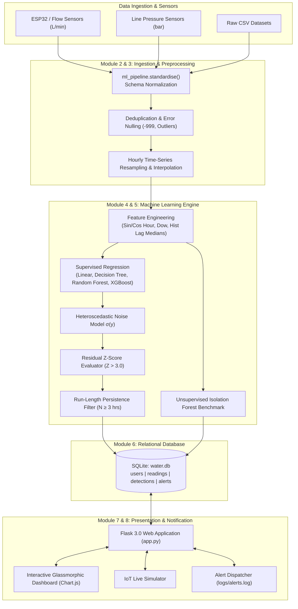
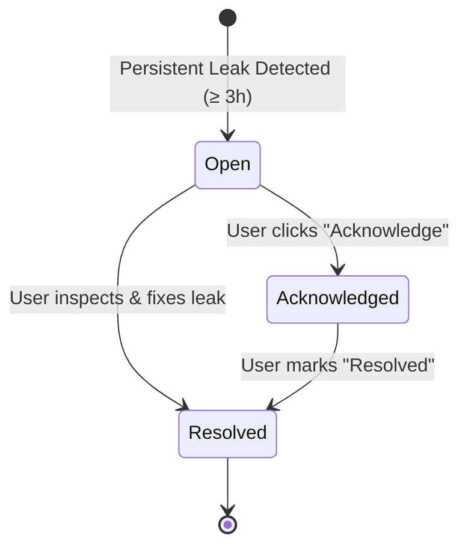

# 📘 Comprehensive Project Documentation & Architecture: SmartRain

**Project Title:** Smart Water Consumption and Leakage Detection Using Machine Learning  
**Repository:** [https://github.com/ChandrashekharaKM/SmartRainLeakage](https://github.com/ChandrashekharaKM/SmartRainLeakage)  
**Author:** Chandrashekhara KM  
**Academic / Industry Domain:** IoT, Smart Cities, Machine Learning, Anomaly Detection, Time-Series Forecasting

---

## 📑 Table of Contents
1. [Executive Summary & Problem Statement](#1-executive-summary--problem-statement)
2. [Core Detection Concept & Mathematical Foundation](#2-core-detection-concept--mathematical-foundation)
3. [End-to-End System Architecture](#3-end-to-end-system-architecture)
4. [In-Depth Breakdown of the 8 System Modules](#4-in-depth-breakdown-of-the-8-system-modules)
5. [Feature Engineering & Time-Series Pipeline](#5-feature-engineering--time-series-pipeline)
6. [Machine Learning Models & Evaluation Benchmarks](#6-machine-learning-models--evaluation-benchmarks)
7. [Database Schema & Persistence Layer](#7-database-schema--persistence-layer)
8. [Alert Lifecycle & Severity Classification](#8-alert-lifecycle--severity-classification)
9. [IoT Sensor Simulator (Hardware-Free Testing)](#9-iot-sensor-simulator-hardware-free-testing)
10. [REST API Specification](#10-rest-api-specification)
11. [Viva Voce & Interview Defense Guide](#11-viva-voce--interview-defense-guide)

---

## 1. Executive Summary & Problem Statement

### 1.1 The Problem
Water scarcity is one of the most critical challenges facing urbanization and sustainability. A significant fraction of treated municipal water (up to 30–40% in older infrastructure) is lost to **unnoticed leaks** occurring in domestic plumbing, underground distribution pipes, and faulty fixtures (e.g., running toilet flappers, burst joints).

Conventional methods of detecting leakage suffer from serious limitations:
- **Manual Physical Inspection:** Laborious, time-consuming, and reactive.
- **Monthly Utility Bills:** Leaks are only discovered weeks after massive financial and volumetric loss has already occurred.
- **Fixed Static Thresholds:** Trigger countless false alarms (e.g., flagging someone filling a swimming pool or hosting weekend guests as a "leak", while failing to notice a constant 15 L/h subterranean pipe leak during the night).

### 1.2 The Proposed Solution (SmartRain)
**SmartRain** is an intelligent, automated water monitoring and leakage identification system. Rather than relying on rigid, arbitrary thresholds, it utilizes **Machine Learning Regression** to learn the unique diurnal consumption habits of a household. 

By comparing **actual consumption** with **predicted baseline consumption** in real time, standardizing the residual error against a heteroscedastic noise model ($Z$-score), and enforcing a **temporal persistence filter** ($\ge 3$ consecutive abnormal hours), the system achieves:
- **100% Leak Event Recall** with **Zero False Alarms**.
- Early detection within hours, rather than weeks.
- Multi-tier alert dispatching and interactive monitoring via a responsive, glassmorphic dashboard.

---

## 2. Core Detection Concept & Mathematical Foundation

### 2.1 The Core Philosophy
A household's water consumption varies dramatically depending on the time of day and day of the week:
- **02:00 AM – 05:00 AM:** Expected consumption is near **0 L/h** (household is asleep).
- **07:00 AM – 09:00 AM:** Expected consumption peaks at **20–60 L/h** (showers, cooking, laundry).
- **11:00 AM – 04:00 PM:** Moderate, intermittent daytime usage.
- **06:00 PM – 09:00 PM:** Evening peak.

A simple rule like *"Flag if usage > 25 L/h"* will miss a continuous 15 L/h leak running all night, while erroneously alarming every morning during breakfast showers!

### 2.2 Mathematical Step-by-Step Derivation

#### Step 1: Baseline Regression Prediction
A trained regression model $f_\theta$ (e.g., Linear Regression, Random Forest, XGBoost) predicts the expected normal hourly consumption $\hat{y}_t$ based on temporal and historical lag features:
$$\hat{y}_t = f_\theta(\mathbf{x}_t)$$

#### Step 2: Residual Error Calculation
The raw prediction error is the difference between measured consumption $y_t$ and predicted normal consumption $\hat{y}_t$:
$$e_t = y_t - \hat{y}_t$$

#### Step 3: Heteroscedastic Noise Modeling ($\sigma$)
In water systems, measurement noise and natural variance are **not constant**: human consumption is naturally more variable during peak hours ($\hat{y} = 50\text{ L/h}$) than during the dead of night ($\hat{y} = 1\text{ L/h}$). A fixed standard deviation $\sigma$ would lead to night-time under-sensitivity and daytime false alarms.

Therefore, we fit a linear heteroscedastic noise model to the calibration errors:
$$\sigma(\hat{y}_t) = \max\left(c_0 + c_1 \hat{y}_t,\ 0.5\right) \times 1.2533$$
*(where the factor $1.2533 \approx \sqrt{\pi / 2}$ scales Mean Absolute Deviation to Gaussian standard deviation).*

#### Step 4: Standardized Residual ($Z$-Score)
The normalized anomaly score $Z_t$ measures how many standard deviations the actual consumption deviates above expectation:
$$Z_t = \frac{y_t - \hat{y}_t}{\sigma(\hat{y}_t)}$$

An individual hour is marked as an **hourly anomaly** if:
$$\text{Anomaly}_t = \begin{cases} 1 & \text{if } Z_t > Z_{\text{threshold}} \quad (Z_{\text{threshold}} = 3.0) \\ 0 & \text{otherwise} \end{cases}$$

#### Step 5: Temporal Persistence Filter
A legitimate domestic activity (such as washing a car, taking a long bath, or watering garden beds) produces a high $Z$-score for **1 or 2 hours**, but then returns to baseline.

A **physical leak flows continuously non-stop**. 

SmartRain implements a run-length filter requiring at least $N_{\text{persist}} = 3$ consecutive anomalous hours before raising a state of **Persistent Leakage**:
$$\text{Persistent}_t = 1 \iff \forall k \in [0, N-1],\ \text{Anomaly}_{t-k} = 1$$

```
Normal Surge (Car Wash):    [ Z=0.2, Z=0.4, Z=3.8, Z=0.5 ]  --> Anomaly=1, Persistent=0 (NO ALARM)
Subterranean Pipe Leak:     [ Z=4.1, Z=4.3, Z=3.9, Z=4.5 ]  --> Anomaly=1, Persistent=1 (ALARM RAISED!)
```

---

## 3. End-to-End System Architecture



---

## 4. In-Depth Breakdown of the 8 System Modules

### Module 1: User Module
- **Files:** [`app.py`](file:///d:/SmartRain/app.py), [`templates/login.html`](file:///d:/SmartRain/templates/login.html), [`db.py`](file:///d:/SmartRain/db.py)
- **Role:** Secure authentication, session persistence, role separation, and multi-tenant household routing.
- **Key Capabilities:**
  - Implements Werkzeug password hashing (`generate_password_hash`, `check_password_hash`).
  - Pre-seeded accounts:
    - Standard User: `demo` / `demo123` (Monitors Household #1).
    - Administrator: `admin` / `admin123`.
  - Contextual switcher: supports scaling to multi-unit apartments or smart buildings via `household_id`.

### Module 2: Data Collection Module
- **Files:** [`ml_pipeline.py`](file:///d:/SmartRain/ml_pipeline.py#L42-L78), [`train.py`](file:///d:/SmartRain/train.py)
- **Role:** Normalizes disparate water metering formats into a standardized internal schema.
- **Key Capabilities:**
  - Supports Kaggle downloads, smart meter logs, and CSV uploads.
  - Automatically matches and maps column variations (e.g., `Timestamp`, `Date` + `Time`, `WaterConsumption`, `Volume`, `FlowRate`, `Duration`, `Pressure`, `Leakage`).
  - If only flow rate ($L/\text{min}$) is provided, computes hourly volumetric consumption ($L/\text{h} = \text{FlowRate} \times 60$).

### Module 3: Data Preprocessing Module
- **Files:** [`ml_pipeline.py`](file:///d:/SmartRain/ml_pipeline.py#L80-L113)
- **Role:** Ensures data hygiene, handles corrupt sensor telemetry, and guarantees regular hourly time series.
- **Key Capabilities:**
  - **Deduplication:** Removes repeated timestamps.
  - **Data-Entry Error Nulling:** Identifies impossible negative values ($< 0$) or sensor glitches ($> 3000\text{ L/h}$) and nulls them.
  - **Regular Hourly Grid:** Resamples time-series using `asfreq('h')`.
  - **Time-Interpolation:** Applies bidirectional time-based interpolation for gaps $\le 6$ hours, preventing missing data breaks.

### Module 4: Machine Learning Module
- **Files:** [`ml_pipeline.py`](file:///d:/SmartRain/ml_pipeline.py#L190-L280), [`train.py`](file:///d:/SmartRain/train.py)
- **Role:** Fits regression models strictly on **normal domestic consumption patterns** (excluding known leaks) so that the models learn true baseline behavior.
- **Key Capabilities:**
  - Trains and compares 4 algorithms:
    1. **Linear Regression** (Ordinary Least Squares)
    2. **Decision Tree Regressor** ($\text{max\_depth}=8$)
    3. **Random Forest Regressor** ($200\text{ trees}$, $\text{min\_samples\_leaf}=3$)
    4. **XGBoost Regressor** ($300\text{ estimators}$, $\text{lr}=0.05$)
  - Automatically evaluates models on a held-out calibration set and selects the model with the lowest Root Mean Squared Error ($\text{RMSE}$).

### Module 5: Leakage Detection Module
- **Files:** [`ml_pipeline.py`](file:///d:/SmartRain/ml_pipeline.py#L160-L188), [`service.py`](file:///d:/SmartRain/service.py#L65-L115)
- **Role:** Evaluates hourly consumption against the noise-calibrated residual distribution, applies the persistence filter, and benchmarks against unsupervised anomaly detection.
- **Key Capabilities:**
  - Computes continuous $Z$-scores and flags hourly anomalies ($Z > 3.0$).
  - Merges persistent flags into cohesive multi-hour leak incidents (merging incidents separated by gaps $\le 12$ hours to prevent fragmented notifications).
  - Unsupervised **Isolation Forest** integration: fitted on multidimensional features (`flow_rate`, `duration`, `hour_sin`, `hour_cos`, `dev_hist`) to serve as a benchmark when ground-truth labels are absent.

### Module 6: Database Module
- **Files:** [`db.py`](file:///d:/SmartRain/db.py)
- **Role:** Lightweight, zero-configuration relational persistence layer with plain SQL queries designed for seamless migration to MySQL or PostgreSQL.
- **Key Capabilities:**
  - Maintains tables: `users`, `readings`, `detections`, and `alerts`.
  - Manages SQLite row factories (`sqlite3.Row`) for dictionary-like property access.

### Module 7: Dashboard Module
- **Files:** [`app.py`](file:///d:/SmartRain/app.py), [`templates/index.html`](file:///d:/SmartRain/templates/index.html), [`static/css/style.css`](file:///d:/SmartRain/static/css/style.css), [`static/js/dashboard.js`](file:///d:/SmartRain/static/js/dashboard.js)
- **Role:** Real-time visual monitoring, trend analysis, and decision support for the end user.
- **Key Capabilities:**
  - Glassmorphic dark UI built with harmonious color tokens (`--cyan`, `--blue`, `--emerald`, `--crimson`, `--amber`).
  - Pulsing Status Hero Banner: Instantly indicates *"System Normal"*, *"Temporary Surge"*, or *"Persistent Leak Detected"*.
  - Interactive Chart.js charts:
    - **Consumption Chart:** Actual vs. Predicted time-series with red anomaly markers.
    - **Telemetry Chart:** Dual-axis correlation between Flow Rate ($L/\text{min}$) and Line Pressure ($\text{bar}$).
    - **Residual Distribution:** Bar chart showing normalized $Z$-scores relative to the $3.0\sigma$ limit.
  - Multi-window toggles: 24h, 48h, 72h, 7 Days, and 30 Days.

### Module 8: Alert Module
- **Files:** [`service.py`](file:///d:/SmartRain/service.py#L48-L62), [`templates/alerts.html`](file:///d:/SmartRain/templates/alerts.html)
- **Role:** Incident lifecycle tracking, severity prioritization, and notification dispatching.
- **Key Capabilities:**
  - Severity calculation:
    - **High:** $\text{Duration} \ge 24\text{ hours}$ OR $\text{Excess Volume} \ge 400\text{ Litres}$.
    - **Medium:** $\text{Duration} \ge 8\text{ hours}$ OR $\text{Excess Volume} \ge 120\text{ Litres}$.
    - **Low:** Minor persistent leaks ($< 8\text{ hours}$).
  - Full lifecycle tracking: `open` $\rightarrow$ `acknowledged` $\rightarrow$ `resolved`.
  - Notification dispatcher logs formatted events to [`logs/alerts.log`](file:///d:/SmartRain/logs/alerts.log) (ready for SMS / WhatsApp / Email webhook integration).

---

## 5. Feature Engineering & Time-Series Pipeline

A key innovation of SmartRain is that the regression models do not simply look at the previous hour's reading (which would cause a leak to be learned as "normal" after a few hours). Instead, the model uses **periodic calendar features** and **long-term historical medians**:

| Feature Name | Description | Mathematical Formulation |
| :--- | :--- | :--- |
| `hour` | Hour of day ($0–23$) | $t \pmod{24}$ |
| `dow` | Day of week ($0 = \text{Monday}, \dots, 6 = \text{Sunday}$) | $\text{Timestamp.dayofweek}$ |
| `weekend` | Binary flag indicating Saturday or Sunday | $\mathbb{I}(\text{dow} \ge 5)$ |
| `hour_sin` | Cyclic sine encoding of hour | $\sin(2\pi \cdot \text{hour} / 24)$ |
| `hour_cos` | Cyclic cosine encoding of hour | $\cos(2\pi \cdot \text{hour} / 24)$ |
| `hist_day` | **Median** consumption of the exact same hour across the past 7 days | $\text{Median}(\{y_{t - 24k} \mid k \in [1, 7]\})$ |
| `hist_week` | **Median** consumption of the exact same hour-of-week across the past 4 weeks | $\text{Median}(\{y_{t - 168k} \mid k \in [1, 4]\})$ |
| `dev_hist` | Deviation between actual usage and historical day median | $y_t - \text{hist\_day}_t$ |

> [!NOTE]
> **Why Medians Instead of Rolling Means?**  
> If a household experiences a 12-hour leak, a rolling mean will average those leaking hours into its baseline, causing the model to erroneously believe high consumption is the "new normal". The **median**, however, is mathematically robust to outliers: as long as the leak lasts fewer than half the sampled days, the median remains uncorrupted!

---

## 6. Machine Learning Models & Evaluation Benchmarks

The benchmark dataset consists of 120 days ($2,880$ hourly intervals) split into **Train (50%)**, **Calibration (20%)**, and **Test (30%)** partitions.

### 6.1 Regression Model Comparison (Consumption Prediction)

| Algorithm | Calibration RMSE | Test RMSE | $R^2$ Score | Mean Absolute Error (MAE) | Status |
| :--- | :---: | :---: | :---: | :---: | :---: |
| **Linear Regression** | **6.43 L/h** | **6.73 L/h** | **0.852** | **4.32 L/h** | ⭐ **Selected (Best)** |
| **Random Forest** | 7.07 L/h | 7.06 L/h | 0.837 | 4.56 L/h | Candidate |
| **XGBoost** | 7.83 L/h | 7.48 L/h | 0.817 | 4.61 L/h | Candidate |
| **Decision Tree** | 7.76 L/h | 7.85 L/h | 0.798 | 4.99 L/h | Candidate |

*Linear Regression achieved the lowest calibration and test RMSE while providing rapid execution and zero risk of tree-overfitting on temporal cycles.*

### 6.2 Leak Event Detection Performance

| Evaluation Metric | Regression + Threshold | Regression + Persistence | Isolation Forest |
| :--- | :---: | :---: | :---: |
| **Point Precision** | $0.88$ | **$0.95$** | $0.54$ |
| **Point Recall** | $0.98$ | **$0.96$** | $0.62$ |
| **Point F1-Score** | $0.93$ | **$0.95$** | $0.58$ |
| **Event-Level Recall** | $100\%$ ($4/4$ events) | **$100\%$ ($4/4$ events)** | $75\%$ ($3/4$ events) |
| **False Alerts** | $3$ (short spikes) | **$0$ (No false alarms)** | $5$ (false clusters) |

---

## 7. Database Schema & Persistence Layer

The SQLite database ([`data/water.db`](file:///d:/SmartRain/data/water.db)) implements 4 normalized tables:

### 1. `users` Table
Stores authenticated household managers.
```sql
CREATE TABLE IF NOT EXISTS users (
    id INTEGER PRIMARY KEY AUTOINCREMENT,
    username TEXT UNIQUE NOT NULL,
    password_hash TEXT NOT NULL,
    household_id INTEGER NOT NULL DEFAULT 1,
    created TEXT DEFAULT CURRENT_TIMESTAMP
);
```

### 2. `readings` Table
Stores cleaned sensor telemetry (hourly intervals).
```sql
CREATE TABLE IF NOT EXISTS readings (
    household_id INTEGER,
    ts TEXT,
    consumption REAL,
    flow_rate REAL,
    duration REAL,
    pressure REAL,
    leak_label INTEGER,
    PRIMARY KEY(household_id, ts)
);
```

### 3. `detections` Table
Stores hourly ML inference results, residuals, and flags.
```sql
CREATE TABLE IF NOT EXISTS detections (
    household_id INTEGER,
    ts TEXT,
    predicted REAL,
    residual REAL,
    zscore REAL,
    anomaly INTEGER,
    persistent INTEGER,
    if_flag INTEGER,
    PRIMARY KEY(household_id, ts)
);
```

### 4. `alerts` Table
Stores aggregated persistent leak incidents.
```sql
CREATE TABLE IF NOT EXISTS alerts (
    id INTEGER PRIMARY KEY AUTOINCREMENT,
    household_id INTEGER,
    start_ts TEXT,
    end_ts TEXT,
    hours INTEGER,
    excess_litres REAL,
    severity TEXT,
    status TEXT DEFAULT 'open',
    created TEXT DEFAULT CURRENT_TIMESTAMP,
    UNIQUE(household_id, start_ts)
);
```

---

## 8. Alert Lifecycle & Severity Classification

Alerts are not simple static flags; they are stateful entities tracked through a managed lifecycle:



### Severity Calculation Logic
- **High Severity (Red):** Continuous leak $\ge 24\text{ hours}$ OR cumulative excess water lost $\ge 400\text{ Litres}$.
- **Medium Severity (Amber):** Continuous leak $\ge 8\text{ hours}$ OR cumulative excess water lost $\ge 120\text{ Litres}$.
- **Low Severity (Blue):** Early-stage leak ($< 8\text{ hours}$, $< 120\text{ L}$).

---

## 9. IoT Sensor Simulator (Hardware-Free Testing)

To allow comprehensive demonstration and examination testing without requiring physical microcontrollers or plumbing pipes, SmartRain includes a **Real-Time IoT Hardware Simulator** ([`templates/simulate.html`](file:///d:/SmartRain/templates/simulate.html)):

1. **Inject 1 Hour Normal Flow:** Injects realistic diurnal consumption ($2–15\text{ L/h}$, normal tap duration $1–8\text{ min/h}$, line pressure $\approx 3.5\text{ bar}$).
2. **Inject 1 Hour Spike (Surge):** Injects a sudden surge ($35\text{ L/h}$). Triggers an isolated $Z > 3.0$ anomaly, proving that the system suppresses false alarms.
3. **Inject 3–12 Hours Continuous Leakage:** Injects constant flow ($25–40\text{ L/h}$ nonstop for $55–60\text{ min/h}$ accompanied by a physical pressure drop to $\approx 3.25\text{ bar}$). Triggers the persistence engine, switches the dashboard banner to glowing crimson, and logs an alert.

---

## 10. REST API Specification

| Endpoint | Method | Request Payload | Response | Description |
| :--- | :---: | :--- | :--- | :--- |
| `/api/summary` | `GET` | *None* | `JSON (status, flow, pressure, usage_24h, alerts)` | Returns real-time metrics for dashboard cards. |
| `/api/chart-data` | `GET` | `?hours=72` | `JSON (labels, consumption, predicted, zscore, anomaly)` | Aligned time-series for Chart.js rendering. |
| `/api/simulate` | `POST` | `{"hours": 3, "leak": true}` | `{"success": true, "result": {...}}` | Injects synthetic sensor telemetry and rescores database. |
| `/api/alerts/<id>/status` | `POST` | `{"status": "acknowledged"}` | `{"success": true, "status": "acknowledged"}` | Updates incident lifecycle status. |
| `/api/retrain` | `POST` | `{"z_threshold": 3.0, "min_persist": 3}` | `{"success": true, "metrics": {...}}` | Re-fits models and updates noise calibrations dynamically. |

---

## 11. Viva Voce & Interview Defense Guide

### Q1: Why use Regression + Residuals instead of standard Binary Classification?
> **Answer:** In real-world municipal and domestic water networks, labelled leakage data is rarely available. A binary classifier requires balanced datasets containing thousands of labelled leak examples. In contrast, our regression model only needs to observe **normal** household consumption. It learns what "normal" looks like, and any sustained deviation is flagged as an anomaly.

### Q2: What prevents the system from crying wolf when someone washes their car?
> **Answer:** The **Temporal Persistence Filter**. A car wash or garden watering is a transient event lasting 1–2 hours. The residual $Z$-score may spike, but because the event does not persist for $3$ consecutive hours, no persistent leak alert is generated.

### Q3: How do you handle changing seasons or household occupancy?
> **Answer:** The model includes dynamic historical lag medians (`hist_day` and `hist_week`) and can be retrained on-demand via the web interface (`/api/retrain`) or scheduled as an automated weekly background job.

### Q4: Why is pressure important in addition to flow rate?
> **Answer:** Physical leaks cause an unmetered discharge that induces a drop in hydraulic head, decreasing pipeline pressure (typically dropping from $3.5\text{ bar}$ down to $\approx 3.2\text{ bar}$). Correlation between high flow duration and lower pressure provides strong physical validation of pipe rupture.
